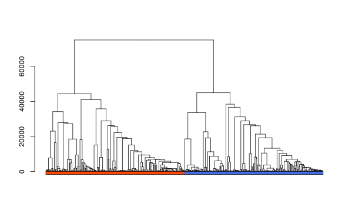

# tgcc: Tree-Guided Convex Clustering in R

The `tgcc` R package implements Tree-Guided Convex Clustering (TGCC), along with its extensions to sparse clustering (sp-TGCC) and bi-clustering (bi-TGCC). This package provides efficient and scalable implementations for convex clustering with tree-guided weights.

## Installation

You can install the development version of `tgcc` from GitHub with:

``` r
# Install 'devtools' if not already installed
install.packages("devtools")

# Install tgcc
devtools::install_github("bingyuan-zhang/tgcc")
```

## TGCC

Tree-Guided Convex Clustering solves the following problem:

$$ \min_{\boldsymbol{\theta}}\frac{1}{2}\sum_{i = 1}^n\|\boldsymbol{y}_i - \boldsymbol{\theta}_i\|_2^2 + \lambda \sum_{i\neq j}w_{ij} \|\boldsymbol{\theta}_i - \boldsymbol{\theta}_j\|_q$$

with the weight

$$ w_{ij} =
\begin{cases}
& \exp(-\|\boldsymbol{y}_i-\boldsymbol{y}_j\|_2^2/\gamma), & (i,j) \in E, \\
& 0, & (i,j) \neq E
\end{cases} $$

where $E\subset \{1, \dots, n\}^2$ is the edge set of a minimum spanning tree. $\it \gamma$ is a given constant.

### Example: Clustering Two Moons Dataset

We demonstrate TGCC on the classic Two Moons dataset to illustrate its ability to detect nonlinear cluster structures.

``` r
set.seed(2025)
dl <- tgcc:::make.twomoons(n = 1e5, diff = -0.4)
data <- dl$data 
label <- dl$label
color <- ifelse(label == 1, "royalblue", "orangered")

# sample 1e4 to plot out
sel <- sample(1e5, 1e4, replace = FALSE)
plot(data[sel,], col = color[sel], 
     pch = 16, cex = 0.3, 
     xlab = "", ylab = "")
```


To apply TGCC, we need to set a tuning parameter sequence for lambda, and a bandwidth value for Gaussian kernel.

``` r
lambdaSeq <- seq(100, nrow(data)/2, length.out = 1000)
bandwidth <- 100
# overall time
system.time({
  tgcc.fit <- tgCC(data = data, lambdaSeq = lambdaSeq, bandwidth = bandwidth)
})

#> user  system elapsed 
#> 1.837   0.464   2.300 
```

The time spent on the dynamic programming and cluster fusion steps specifically:

``` r
# tgcc fitting time
tgcc.fit$tgccTime

#> elapsed 
#> 0.869
```

The accuracy of estimated labels compared to the true labels:

``` r
estlabel <- clusterLabel(tgcc.fit, numClusters = 2)
1 - mclust::classError(estlabel, label)$errorRate

#> [1] 0.99668
```

The estimated labels of sampled data points:*


The corresponding dendrogram:

``` r
fit.sum <- tgcc:::parsHeatmap(tgcc.fit, label, show = 500, k = 2)
dend <- fit.sum$dend

dendextend::labels(dend) <- rep("", length(labels(dend)))
plot(dend)
col <- ifelse(fit.sum$rowcolor == 1, "royalblue", "orangered")
dendextend::colored_bars(
  col, text_shift = NULL, y_shift = -5)
```



The y-axis shows the lambda values. Because it is impossible to show a dendrogram for $1e5$ points, the color bar shows the true labels of intermediate clusters of the Two Moon dataset. The colors indicate the mode of labels in each intermediate cluster.

## Extensions of TGCC

TGCC can be easily extended to: - Sparse-clustering (`spTGCC`) - Bi-clustering (`biTGCC`)

These extensions share a unified loss:

$$  
L(\boldsymbol{\Theta}) = \frac{1}{2}\|\boldsymbol{Y} - \boldsymbol{\Theta}\|_F^2 + P_{1, \lambda}(\boldsymbol{\Theta}) + P_{2, \gamma}(\boldsymbol{\Theta})
$$

with:

$$
P_{1, \lambda}(\boldsymbol{\Theta}) = \lambda\sum_{i=1}^n\sum_{j\neq i}^n \alpha_{ij}\|\boldsymbol{\Theta}_{i\cdot} - \boldsymbol{\Theta}_{j\cdot}\|_1,
$$

and: $$
P_{2, \gamma}(\boldsymbol{\Theta}) = 
    \begin{cases}
        \gamma\sum_{i=1}^p\sum_{j\neq i}^p\beta_{ij}\|\boldsymbol{\Theta}_{\cdot i} - \boldsymbol{\Theta}_{\cdot j}\|_1, & \text{for biclustering},\\
        \gamma \sum_{i=1}^p \|\boldsymbol{\Theta}_{.i}\|_2, &\text{for sparse clustering.}
    \end{cases}
$$

#### Sparse Clustering Setting (spTGCC)

`spTGCC` simultaneously identifies clusters and removes noisy features.

``` r
# generate FS model ground truth
set.seed(2024)
FSmodel <- tgcc:::make.fourspherical(n=400)
order <- order(FSmodel$label)
data <- FSmodel$data[order, ]
label <- FSmodel$label[order]
data0 <- FSmodel$groundtruth[order, ]
```

Estimated matrices are visualized as heatmaps:

``` r
# tuning parameters
gammaSeq <- c(1, 1.5, 1.9)
lambdaSeq <- c(30, 60, 120)

# fit the spTGCC model
tgccFit <- spTGCC(
  data = data, 
  lambdaSeq = lambdaSeq,
  gammaSeq = gammaSeq,
  threshold = 1e-05,
  maxIter = 100)

# set color
range <- quantile(data[!is.na(data)], c(0.0, 0.5, 1))
colfun <- circlize::colorRamp2(range, 
  c("blue", "white", "red"))
breaks <- seq(min(data, na.rm = TRUE), max(data, na.rm = TRUE), length.out = 256)
colvec <- colfun(breaks)

showHeatmap <- function(data, colvec) {
  pheatmap::pheatmap(
    mat = data,
    color = colvec,
    cluster_rows = FALSE,
    cluster_cols = FALSE,
    legend = FALSE,
    na_col = "grey65"
  )
}

showHeatmap(data0, colvec)
showHeatmap(data, colvec)
showHeatmap(tgccFit$theta[[1]], colvec)
showHeatmap(tgccFit$theta[[2]], colvec)
showHeatmap(tgccFit$theta[[3]], colvec)
```


#### Biclustering Setting (biTGCC)

`biTGCC` simultaneously obtains the clusters in both samples and features.

``` r
# generate the checkboard example
set.seed(2024)
CBmodel <- tgcc:::make.checkerboard(n = 400)
data <- CBmodel$data
label <- CBmodel$label
data0 <- CBmodel$groundTruth
```

Estimated matrices are visualized as heatmaps.

``` r
# tuning parameter of lambda and gamma
lambdaSeq <- gammaSeq <- c(20, 50, 150)

# fit the biTGCC model
tgccFit <- biTGCC(
    data,
    lambdaSeq,
    gammaSeq,
    threshold = 1e-05 * nrow(data) * ncol(data),
    maxIter = 100)

# set color
range <- quantile(data[!is.na(data)], c(0, 0.5, 1))
colfun <- circlize::colorRamp2(range, c("blue", "white", "red"))
breaks <- seq(min(data, na.rm = TRUE), max(data, na.rm = TRUE), length.out = 256)
colvec <- colfun(breaks)

showHeatmap(data0, colvec)
showHeatmap(data, colvec)
showHeatmap(tgccFit$theta[[1]], colvec)
showHeatmap(tgccFit$theta[[2]], colvec)
showHeatmap(tgccFit$theta[[3]], colvec)
```


## Reference

Tree-Guided $L_1$-Convex Clustering by Bingyuan Zhang and Yoshikazu Terada.

See also the [simulation code](https://github.com/bingyuan-zhang/tgcc_simulation_code) in the TGCC paper.
