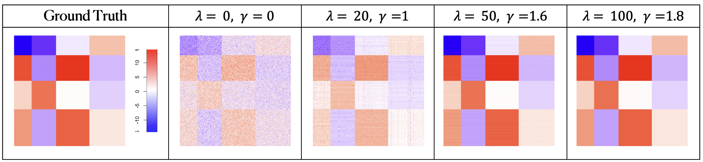

## Tree-guided convex clustering

R package `tgcc` implements the tree-guided convex clustering (TGCC) and its extensions.

## Contents

-   [Installation](#installation)
-   [Examples](#examples)
    -   [Example 1: TGCC]
    -   [Example 2: Extensions of TGCC]

## Installation {#installation}

Run the following code in Rstudio to install `tgcc` from GitHub.

``` r
library(devtools)
install_github("bingyuan-zhang/tgcc")
```

## Examples {#examples}

We apply TGCC to the following examples.

At the beginning, we load the `tgcc` package.

``` r
library(tgcc)
```

### Example 1: TGCC

The first example is a mixture Gaussian model as follows.

The ground truth of labels were shown in different colors as follows.

``` r
set.seed(2024)
dl <- tgcc:::make.mixgaussian(n = 400)
data <- dl$data
label <- dl$label
plot(data, col=label)
```


To apply TGCC, we set a tuning parameter sequence for lambda, and adjust the bandwidth to be 1 (see other parameters `?tgcc::tgCC`).

`makeDendrogram` provides a dendrogram visualization of the convex clustering result. The y-axis represents the value of lambda, and colors indicate the input labels.

``` r
lambdaSeq <- seq(1, 4000, length.out = 100)
bandwidth <- 1
tgccFit <-
  tgcc::tgCC(data = data, lambdaSeq = lambdaSeq, bandwidth = bandwidth)
tgcc::makeDendrogram(tgccFit, label)
```


By comparing the obtained labels with the ground truth, we can obtain the clustering performance accuracy (see also `classError` in `mclust` package).

``` r
predLabel <- tgcc::clusterLabel(tgccFit, numClusters=3)
1-mclust::classError(label, predLabel)$errorRate
```

```         
[1] 0.9875
```

### Example 2: Extensions of TGCC

TGCC can be easily extended for other different settings under the convex clustering framework.

We show the extensions of TGCC in the sparse clustering and the biclustering setting.

#### Sparse Clustering Setting

For the sparse clustering setting, we generate the Four Spherical example.

`spTGCC` obtains the clusters while removing the noisy features simultaneously.

``` r
set.seed(2024)
FsModelDat0 <- tgcc::make.fourspherical(300, isGroundTruth = TRUE)
data0 <- FsModelDat0$data[order(FsModelDat0$label), ]
ComplexHeatmap::pheatmap(data0, cluster_rows = F, cluster_cols = F, legend = F)
```

The estimated centroid matrix is visualized as a heatmap using `pheatmap` in `ComplexHeatmap` R package.

``` r
# generate the data matrix following the FS model
set.seed(2024)
FsModelDat <- tgcc::make.fourspherical(300)
data <- FsModelDat$data
label <- FsModelDat$label
data <- data[order(label), ]
label <- sort(label)

# tuning parameter of lambda and gamma
threshold <- 1e-05
maxIter <- 100
gammaSeq <- rep(1.7, 10)
lambdaSeq <- seq(1, 60, length.out=10)

# fit the biTGCC
tgccFit <- tgcc::spTGCC(
  data = data,
  lambdaSeq = lambdaSeq,
  gammaSeq = gammaSeq,
  threshold = threshold,
  maxIter = maxIter)

# calculate the error rate
predLabel <- tgcc::clusterLabel(tgccFit, numClusters=4)
1-mclust::classError(label, predLabel)$errorRate

# estimated centroid matrix
Theta <- tgccFit$theta
ComplexHeatmap::pheatmap(data, cluster_rows = F, cluster_cols = F, legend = F)
ComplexHeatmap::pheatmap(Theta[[4]], cluster_rows = F, cluster_cols = F, legend = F)
ComplexHeatmap::pheatmap(Theta[[5]], cluster_rows = F, cluster_cols = F, legend = F)
ComplexHeatmap::pheatmap(Theta[[10]], cluster_rows = F, cluster_cols = F, legend = F)
```


#### Biclustering Setting

For the biclustering setting, we generate the Check Board example.

`biTGCC` obtains the clusters in both samples and features.

``` r
set.seed(2024)
FsModelDat0 <- tgcc:::make.checkboard(300, isGroundTruth = TRUE)
data0 <- FsModelDat0$data[order(FsModelDat0$label), ]
pheatmap(data0, cluster_rows = F, cluster_cols = F, legend = F)
```

The estimated centroid matrix is visualized as a heatmap using `pheatmap` in `ComplexHeatmap` R package.

``` r
# generate check board model
set.seed(2024)
FsModelDat <- tgcc:::make.checkboard(300)
data <- FsModelDat$data
label <- FsModelDat$label
data <- data[order(label), ]
label <- sort(label)

# tuning parameter of lambda and gamma
lambdaSeq <- gammaSeq <- seq(1, 60, length.out=10)
n <- nrow(data); 
p <- ncol(data); 
maxIter <- 100
threshold <- 1e-05 * n * p

# fit the biTGCC model
tgccFit <-
  tgcc:::biTGCC(data,
    lambdaSeq,
    gammaSeq,
    threshold = threshold,
    maxIter = maxIter)

# calculate the error rate
predLabel <- tgcc:::clusterLabel(tgccFit, numClusters=4)
1-mclust::classError(label, predLabel)$errorRate


# estimated centroid matrix theta
Theta <- tgccFit$theta
ComplexHeatmap::pheatmap(data, cluster_rows = F, cluster_cols = F, legend = F)
ComplexHeatmap::pheatmap(Theta[[2]], cluster_rows = F, cluster_cols = F, legend = F)
ComplexHeatmap::pheatmap(Theta[[4]], cluster_rows = F, cluster_cols = F, legend = F)
ComplexHeatmap::pheatmap(Theta[[10]], cluster_rows = F, cluster_cols = F, legend = F)
```


